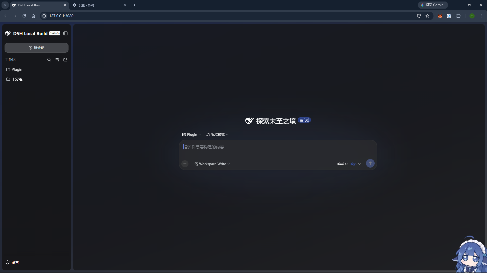
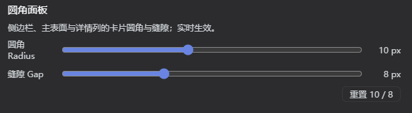

# dsh-rounded-panels

VS Code 风格的 DSH Web 圆角悬浮面板插件。



## 效果

- 侧边栏、主表面（对话区）、详情列变为悬浮圆角卡片（默认 10px 圆角 + 1px 细边框），四边外圈留白与列间缝隙透出底层背景（默认 8px）；
- 设置界面对话框跟随同一圆角；
- 兼容 [`dsh-client-ui-custom`](https://github.com/yoli-mi/dsh-client-ui-custom) 美化插件：对其提供的历史条做了优化，收起态 rail 图标自动居中；壁纸/玻璃拟态/强调色等颜色控制权完全留给美化插件（本插件零颜色覆盖）。

## 调节

设置 → 通用设置 → 「圆角面板」行：



- **圆角 Radius**：0–24px，实时作用于全部卡片与设置对话框；
- **缝隙 Gap**：0–24px，同步控制外圈留白与列间缝隙，历史条补偿与 rail 居中性自动跟随；
- 重置按钮恢复 10 / 8。

## 安装

```sh
dsh plugin --profile web add dsh-rounded-panels
# 或本地开发：
dsh plugin --profile web add link:<本目录绝对路径>
```

Bundle 成员变化需要重启该 Profile 生效。

## 原理速记

- 纯几何 CSS：选择器走渲染器官方 `[data-slot]` 锚点，不碰哈希类名；不覆盖任何颜色 token；
- 浏览器束为手工工厂格式（`window.__ModuleLoader__.load`），免构建。
